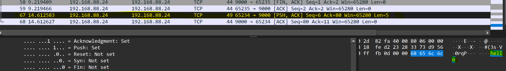

# פרויקט גמר: ניתוח תעבורה בפרוטוקול TCP/IP ומימוש יישום רשת
 **רשתות תקשורת מחשבים** 

**מגישים:** נתנאל ציפלקוב, מתיתיהו ציפלקוב, טוני אטמה

## 📖 סקירה כללית
פרויקט זה מדגים הבנה מעמיקה של מודל השכבות (TCP/IP) דרך שני שלבים מרכזיים:
1. **סימולציית אריזת נתונים (Encapsulation):** בניית חבילות מידע משכבת האפליקציה ועד שכבת הקישור.
2. **פיתוח מערכת צ'אט מבוזרת:** מימוש שרת ולקוח (Server-Client) ב-Python עם ניתוח תעבורה חי ב-Wireshark.

---

## 🛠️ חלק 1: אריזת נתונים ולכידת מנות (Wireshark & Jupyter)
בחלק זה הדגמנו כיצד הודעות גולמיות הופכות למנות רשת תקניות.

### תהליך העבודה:
* **קלט (CSV):** יצרנו קובץ בשם `group11_http_input.csv` המכיל 118 הודעות HTTP (כמו GET ו-POST) עם פורטים (42069 ללקוח, 80 לשרת) בעזרת ה-ai (chatgpt).
* **אריזה (Encapsulation):** השתמשנו במחברת Jupyter ובספריית **Scapy** כדי לעטוף כל שורה מה-CSV בשכבות הבאות:
    * **Application Layer:** תוכן הודעת ה-HTTP.
    * **Transport Layer (TCP):** הוספת Source/Destination Ports.
    * **Network Layer (IPv4):** הוספת כתובות IP.
    * **Link Layer (Ethernet):** הכנה למסגרת (Frame).
* **לכידה:** הרצנו את הסקריפט ולכדנו את התעבורה ב-Wireshark (קובץ pcap). ניתן לראות שם את ה-Handshake ואת ה-Payload של ה-HTTP שבנינו.

---
## 💬 חלק 2: יישום צ'אט מבוזר (Chat Application)
פיתחנו אפליקציית צ'אט מלאה ב-Python המאפשרת תקשורת בזמן אמת בין משתמשים שונים.

### ארכיטקטורה ויכולות:
* **שרת (server.py):** מבוסס TCP Socket, מנהל את כל הלקוחות המחוברים בו-זמנית בעזרת ריבוי תהליכונים (Multithreading).
* **לקוח (client_kivy.py):** ממשק גרפי מודרני המאפשר התחברות, שליחת הודעות פומביות והודעות פרטיות ואף לשחק איקס עיגול עם משתמשים אחרים! (בשיחה הפרטית).
* **גילוי שרת (Discovery):** מימשנו מנגנון UDP Broadcast המאפשר ללקוח למצוא את השרת ברשת המקומית באופן אוטומטי ללא ידיעת ה-IP מראש.
* **טיפול בשגיאות:** המערכת יודעת לזהות ניתוקים פתאומיים של לקוחות ולעדכן את רשימת המשתמשים ב-GUI בזמן אמת.

### טכנולוגיות:
* **Python Sockets:** לעבודה מול שכבת התעבורה.
* **Kivy / CustomTkinter:** לבניית ממשקי המשתמש (UI).
* **Threading:** לטיפול במקביליות (קבלת הודעות תוך כדי שליחה).

---

## 📊 ניתוח תעבורת היישום (Wireshark Analysis)
במהלך הרצת היישום, לכדנו את התעבורה וניתחנו את השכבות:
1. **שכבת התעבורה (TCP):** זיהינו את ה-3-Way Handshake (חבילות SYN, SYN-ACK, ACK).

2. **שכבת הרשת (IP):** וידאנו שכתובות ה-IP וה-TTL נכונים.
3. **שכבת היישום:** ניתחנו את המבנה של הודעות ה-Chat שנשלחו כ-Data בתוך ה-TCP Segment.

---

## 🤖 שימוש בבינה מלאכותית
בפרויקט זה נעזרנו ב-AI (ChatGPT) לצורך:
1. אופטימיזציה של ממשקי ה-Kivy וטיפול בעיצוב ה-GUI (Aether Theme). 
2. יצירת מערך הנתונים (CSV) עבור סימולציית ה-HTTP בחלק 1.
3. ייעוץ בפתרון באגים מורכבים במנגנון ה-Threading והנעילות בשרת.

פרומפטים לדוגמא:
* "How to handle multiple TCP clients in Python using threading?"
* "Debug socket disconnection issues in Python"
---
## 🚀 הוראות הרצה
1. התקנת דרישות: `pip install customtkinter kivy scapy pandas`.
2. הרצת השרת: `python server.py`.
3. הרצת הלקוח: `python client_kivy.py`.

---

**סיכום:** הפרויקט ממחיש את המעבר מתיאוריה (מודל 7 השכבות) לפרקטיקה (כתיבת קוד וניתוח פרוטוקולים במערכת חיה).

