<div dir="rtl">


## 🌐 Network Communication Project – TCP/IP, Wireshark & Socket Programming

---

## סקירה כללית
פרויקט זה בוצע במסגרת קורס **רשתות תקשורת** ומטרתו להעמיק את ההבנה המעשית והעיונית בעקרונות התקשורת ברשת, מודל TCP/IP, אריזת נתונים, ולכידת וניתוח תעבורה באמצעות Wireshark.

הפרויקט משלב בין:
-  ידע תיאורטי (מודל שכבות TCP/IP)
-  ניסויים וניתוח תעבורה אמיתית
-  מימוש מערכת Client–Server מלאה

הפרויקט מחולק לשני חלקים מרכזיים:
1. 🦈 אריזת נתונים ולכידת מנות באמצעות Wireshark  
2. 💬 מימוש יישום רשת מבוסס TCP וניתוח תעבורתו
--- 
## תוכן עניינים


[חלק 1 – אריזת נתונים ולכידת מנות (Wireshark)](#part1)   
   2.1 [שלב 1 – יצירת קובץ CSV](#part1-step1)  
   2.2 [שלב 2 – עיבוד הקובץ במחברת Jupyter](#part1-step2)  
   2.3 [תהליך אריזת המנות (Encapsulation)](#part1-encapsulation)  
   2.4 [שלב 3 – לכידת תעבורה ב-Wireshark](#part1-step3)  
   2.5 [תיאור וניתוח תעבורה שנלקדה](#part1-analysis)  

[חלק 2 – מימוש יישום רשת](#part2)  
   3.1 [ארכיטקטורת המערכת](#architecture)  
   3.2 [הוראות התקנה והרצה](#installation)  
   3.3 [דוגמאות קלט ופלט](#examples)  
   3.4 [ניתוח תעבורה ב-Wireshark](#tcp-analysis)  

[שימוש בבינה מלאכותית (AI)](#ai) 

[סיכום](#summary)

---
<a id="part1"></a>

#  חלק 1 – אריזת נתונים ולכידת מנות (Wireshark)

### מטרות החלק
- הבנת תהליך אריזת הנתונים משכבת היישום ועד שכבת הרשת  
- תרגול עבודה עם Wireshark ולכידת מנות  
- קישור בין מידע לוגי (CSV) לתעבורת רשת בפועל  

---
<a id="part1-step1"></a>
## 📁 שלב 1 – יצירת קובץ CSV (שכבת היישום)
נוצר קובץ CSV בעזרת הAI (chatgpt) המכיל הודעות ברמת שכבת היישום.

**שדות הקובץ:**
- msg_id  
- app_protocol  
- src_app  
- dst_app  
- message  
- timestamp 
- src_port
- dst_port

**דוגמה:**
    1,HTTP,client_browser,web_server,GET /index.html,0.015,42069,80

 **מה למדנו:**  
כיצד הודעות נראות ברמת היישום לפני שהן נארזות לשכבות התקשורת, והחשיבות של הפרדת תוכן ממנגנון התקשורת.

---
<a id="part1-step2"></a>
## 📓 שלב 2 – עיבוד הקובץ במחברת Jupyter
בוצעה טעינה של קובץ ה-CSV והדמיה של תהליך אריזת הנתונים בשכבות:
- Application  
- Transport (TCP)  
- Network (IP)  
<a id="part1-encapsulation"></a>
## תיאור והסבר על תהליך אריזת המנות :

בחלק זה דימינו את תהליך ה-**Encapsulation** (אריזה בשכבות) המתרחש במודל TCP/IP, תוך שימוש במחברת Jupyter ובקובץ נתוני קלט. התהליך התבצע בצורה היררכית, מהשכבה העליונה לתחתונה:

1. **שכבת האפליקציה (Application Layer):**
   * המקור לנתונים הוא קובץ ה-CSV (`group11_http_input.csv`) המכיל הודעות HTTP גולמיות.
   * כל שורה בקובץ מייצגת הודעת אפליקציה, למשל: `GET /logo.png` או תשובת שרת `HTTP/1.1 301 Moved`.
   * במחברת, המידע האפליקטיבי נטען ל-DataFrame ועבר המרה לבייטים (Encoding) כדי שיוכל לשמש כ-"Payload" לשכבות הבאות.

2. **שכבת התעבורה (Transport Layer - TCP):**
   * עבור כל הודעה, נבנתה כותרת TCP (Header) בעזרת פונקציות המרה במחברת.
   * הכותרת כללה את פורט המקור ופורט היעד שהוגדרו ידנית ב-CSV (לדוגמה: פורט `42069` עבור הלקוח ופורט `12345` עבור השרת).
   * בשלב זה נקבעו דגלי הבקרה (Flags) כגון `PSH+ACK` (ערך `0x18`) כדי לסמן שהמידע מוכן להעברה מיידית לאפליקציה בצד השני.

3. **שכבת הרשת (Internet Layer - IPv4):**
   * חבילת ה-TCP נארזה בתוך כותרת IP בעזרת פונקציית בנייה ייעודית במחברת.
   * הוגדרו כתובות ה-IP של המקור והיעד (בפרויקט זה השתמשנו בכתובת הלופבק `127.0.0.1`).
   * התהליך כלל חישוב Checksum עבור ה-IP וה-TCP כדי להבטיח את תקינות הנתונים במעבר.

4. **שכבת הקישור והעברה (Link Layer & Sending):**
   * המנה המוכנה (IP + TCP + Data) הועברה למערכת השליחה.
   * במערכת Windows, השתמשנו בספריית **Scapy** ובמנהל ההתקן **Npcap** כדי "להזריק" את המנה ישירות לשכבת הקישור, מה שאפשר למנה לעבור בכרטיס הרשת הווירטואלי (Loopback Adapter) למרות מגבלות מערכת ההפעלה על Raw Sockets.

---
<a id="part1-step3"></a>
## 🦈 שלב 3 – לכידת תעבורה ב-Wireshark
בוצעה לכידת תעבורה חיה תוך שימוש במסנני TCP ושמירת הקובץ בפורמט pcap.

## תיאור והסבר על תהליך הלכידה והניתוח ב-Wireshark :

לאחר שלב אריזת המנות, ביצענו לכידה של התעבורה בזמן אמת כדי לוודא שהמנות עברו את כל שלבי המודל בצורה תקינה. התהליך כלל את הצעדים הבאים:

1. **הגדרת ממשק הלכידה:**
   * במערכת Windows, הקוד במחברת זיהה והשתמש במתאם הלופבק הייעודי (**Npcap Loopback Adapter**).
   * פעולה זו הכרחית מכיוון שתעבורה פנימית (127.0.0.1) אינה עוברת דרך כרטיס הרשת הפיזי, ולכן נדרש "כרטיס רשת וירטואלי" המאפשר ל-Wireshark להאזין לתקשורת המקומית.

2. **תהליך השליחה והזרקת המנות:**
   * במחברת הופעל תהליך שרץ בלולאה על פני כל השורות ב-CSV. 
   * עבור כל הודעה, הקוד חילץ את תוכן ההודעה והשתמש בפונקציה `transport.send` כדי להעביר אותה.
   * הקוד השתמש בספריית **Scapy** כדי לבנות אובייקטים מסוג `IP` ו-`TCP`. הזרקת המנות בוצעה ישירות לשכבת הקישור (Layer 2) תוך עקיפת מחסומי אבטחה של מערכת ההפעלה.
   * הקוד הוסיף השהייה מתוזמנת (`time.sleep`) בין שליחה לשליחה כדי לאפשר תצוגה כרונולוגית ברורה ב-Wireshark ולמנוע עומס על ה-Buffer.


3. **סינון וניתוח ב-Wireshark:**
   * כדי לבודד את התעבורה הרלוונטית בקובץ הלכידה, השתמשנו במסננים (Filters) כגון: `ip.addr == 127.0.0.1`.
   * בבחינת המנות בתוך קובץ ה-PCAP, זיהינו את חבילות ה-**IPv4** שהכילו בתוכן את סגמנט ה-**TCP**.
   * וידאנו שה-Payload (המטען) של המנות מכיל את מחרוזות הטקסט מה-CSV המקורי (כמו הודעות ה-HTTP השונות).

4. **אימות מבנה המנה מהלכידה הממשית:**
   * ניתחנו את השדות הטכניים כפי שהם מופיעים ב-Wireshark:
     * **Source/Destination Port:** זיהינו את הפורטים כפי שהוגדרו ( פורט `12345` ו-`42069`).
     * **Sequence Numbers:** ניתן לראות כיצד כל מנה מקבלת מספר סידורי המאפשר את הרכבת המידע בצד המקבל.
     * **Flags:** זיהינו שימוש בדגלי **PSH (Push)** ו-**ACK** (ערך הקסדצימלי `0x18`), המורים למערכת ההפעלה להעביר את הנתונים מיד לאפליקציה מבלי להמתין למילוי מלא של המאגר (Buffer).
       
<a id="part1-analysis"></a>
## תיאור והסבר של תעבורה שנלקדה ב-Wireshark :


### 1. מבנה השכבות (The OSI Model in Practice)
בכל מנה שנבחר ב-Wireshark, ניתן לראות את ההיררכיה שיצרנו במחברת. השכבות מסודרות מהנמוכה לגבוהה: Ethernet (קישור), IPv4 (רשת), TCP (תעבורה), ונתוני ה-HTTP (אפליקציה).

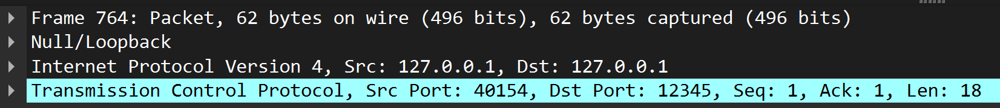

### 2. שכבת ה-IP וכתובות הלופבק
בלכידה ניתן לראות שכתובות המקור (Source) והיעד (Destination) הן `127.0.0.1`. זהו אימות לכך שהזרקת המנות עבדה דרך ה-Npcap Loopback Adapter. ניתן לראות בשדה ה-Protocol שכתוב `TCP`, מה שמראה שה-IP "נושא" בתוכו סגמנט תעבורה.

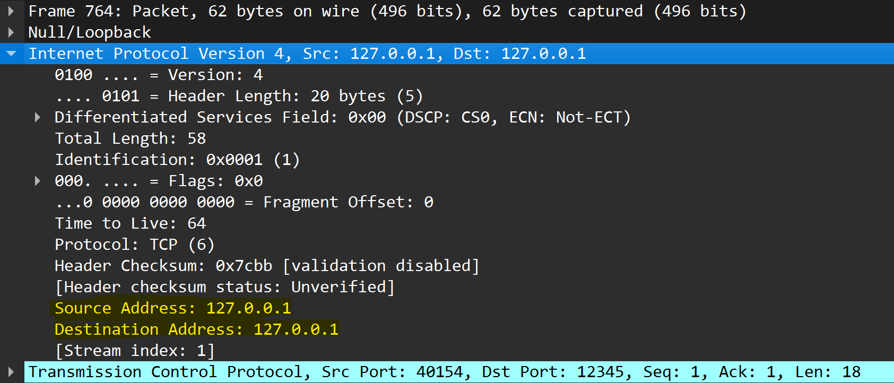

### 3. פורטים בשכבת התעבורה (TCP Ports)
השתמשנו בפורטים שהגדרנו ידנית ב-CSV. ב-Wireshark ניתן לראות את ה-Source Port (למשל `42069` בבקשת לקוח) ואת ה-Destination Port (למשל `80` עבור שרת ה-Web). הפרדה זו מאפשרת למחשב לדעת לאזו אפליקציה לשלוח את המידע.

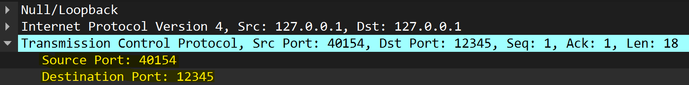

### 4. דגלי בקרה (Flags)
שדה ה-Flags ב-TCP מספק הנחיות לניהול הקשר. במחברת הגדרנו את הערך הקסדצימלי `0x18`.
* **מה זה אומר?** ערך זה מייצג שילוב של **PSH (Push)** ו-**ACK (Acknowledgment)**.
* **איך רואים זאת בלכידה?** תחת עץ ה-Flags ב-TCP, נראה ששני הדגלים הללו הם היחידים שמסומנים ב-"Set" (1). דגל ה-PSH מבטיח שהנתונים יעברו מיד לאפליקציה ולא יתעכבו בזיכרון המערכת.

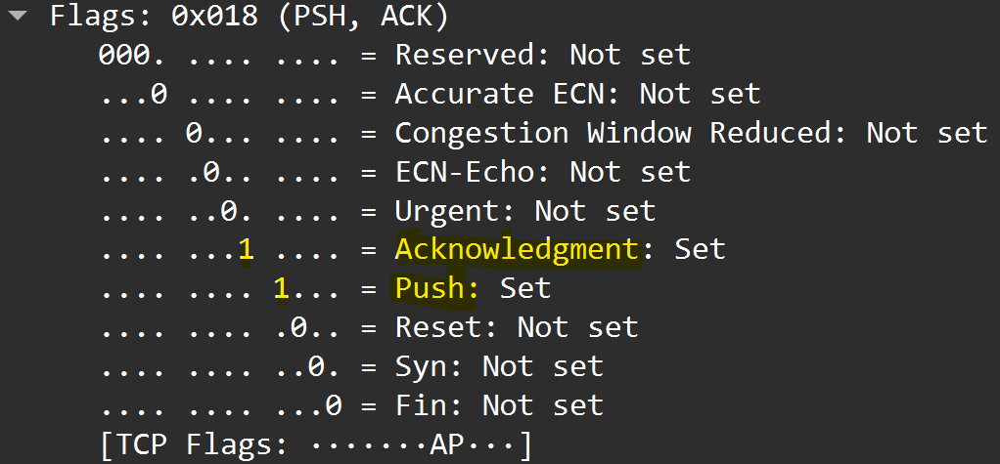

### 5. תוכן המנה (Payload / Data)
זהו החלק ה"עטוף" ביותר. בתוך ה-Payload של ה-TCP, ניתן לראות את המחרוזת המקורית שכתבנו ב-CSV.
* **דוגמה מהלכידה:** אם נסתכל על הייצוג ב-ASCII (בצד ימין למטה ב-Wireshark), נראה בבירור טקסט כמו `GET /logo.png` או `HTTP/1.1 301 Moved`. זהו האישור הסופי לכך שכל תהליך האריזה הצליח והמידע הגיע ליעדו ללא שינוי.

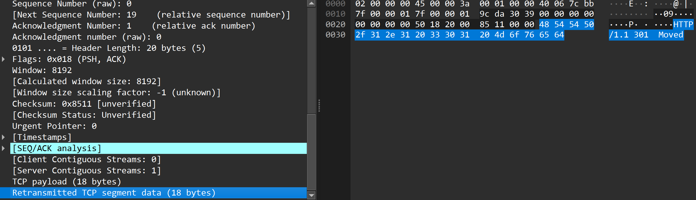
---
<a id="part2"></a>
# 💬 חלק 2 – מימוש יישום רשת וניתוח תעבור

###  מטרות החלק
- מימוש מערכת Client–Server מבוססת TCP  
- עבודה עם Sockets ברמה נמוכה  
- טיפול בריבוי לקוחות  
- ניתוח תעבורת רשת של יישום אמיתי  

---
<a id="architecture"></a>
## ארכיטקטורת המערכת: Lord of the Pings

## א. הסבר כללי על המערכת ומבנה הקוד


המערכת פועלת בארכיטקטורת **Client-Server** חכמה מעל פרוטוקול TCP. בניגוד לשרתים פשוטים המפיצים הכל לכולם, השרת שלנו מנהל תקשורת סלקטיבית ומותאמת אישית לכל לקוח.

### 1. השרת (Server-Side) - ניהול סוקטים וניתוב חכם
השרת (`server.py`) פועל בצורה **אסינכרונית** מלאה ומנהל "מילון לקוחות" (Clients Dictionary):
* **סוקט ייעודי לכל לקוח:** עבור כל לקוח שמתחבר, השרת פותח סוקט (Socket) ייחודי ו-Thread נפרד. הדבר מאפשר לשרת לנהל שיחות מקבילות ומבודדות.
* **ניתוב הודעות פרטיות (Private Chats):** השרת מזהה את נמען ההודעה לפי ה-JSON. הוא שולח את הודעת ה-Private Chat **אך ורק** לסוקט של הלקוח הרלוונטי. לקוחות אחרים במערכת לא מקבלים את המידע הזה, מה שמבטיח פרטיות ברמת הרשת.
* **Broadcasting מוגבל:** השרת מבצע הפצה לכולם (Broadcast) אך ורק עבור הודעות שנשלחו ב"צ'אט הקבוצתי".
* **ממשק ניהול (GUI):** נבנה ב-`CustomTkinter`, מאפשר למנהל לראות מי מחובר ולנהל את השרת בצורה ויזואלית.

### 2. הלקוח (Client-Side)
הלקוח (`client.py`) נבנה בעזרת ספריית `Kivy`:
* **פונקציית ה-Discover:** מנגנון המאפשר ללקוח לאתר את כתובת ה-IP של השרת ברשת המקומית באופן אוטומטי בעזרת תקשורת UDP אשר השרת עושה broadcast בפורט 9001 דיפולטי ובהודעת הudp נאמר מה הip והport של השרת כרגע (כדי לאפשר תקשורת של שני מחשבים זרים).
* **הפרדת ממשק ותקשורת:** הלקוח מריץ Thread רקע שמאזין לסוקט האישי שלו. ברגע שהשרת דוחף (Push) הודעה לסוקט הזה, הלקוח מעבד אותה ומציג אותה ב-UI.
* 
### 3. פרוטוקול ההודעות
התקשורת מתבצעת באמצעות הודעות **JSON** המומרות ל-Bytes. כדי לפתור את בעיית ה-Stream ב-TCP (איפה הודעה מתחילה ונגמרת), כל הודעה מסתיימת בתו `\n`.

* נעשה שימוש במבנה נתונים dictionary בכדי לשמור שמות של משתמשים והאייקונים והמידע המתאים להם הן בשרת והן בלקוח.
---
<a id="installation"></a>
## ב. הוראות התקנה והרצה

### ⚙️ דרישות מוקדמות וספריות (Imports)
לפני ההרצה, יש לוודא שמותקנות כל הספריות הבאות (אלו הספריות שנעשה להן Import בקוד):
* **Kivy**: עבור ממשק הלקוח.
* **CustomTkinter**: עבור ממשק השרת.
* **python-dotenv**: לניהול משתני סביבה.
* **Socket & Threading**: (רק לבדוק שקיימות) ספריות מובנות לניהול התקשורת.
* **JSON**: (קיים בפייתון בדיפולט) לעיבוד הפרוטוקול. 
* 
```bash

```

### הגדרת קובץ .env
במידה ורוצים להריץ לוקאלית על אותו מחשב, יש ליצור קובץ בשם `.env` בתיקיית הפרויקט ולכתוב בו:
```bash
HOST=127.0.0.1
```
### הרצת המערכת
1. **הפעלת השרת:** הריצו את הפקודה: 
```bash
 python server.py
```
2. **הפעלת לקוחות:** הריצו את הפקודה (ניתן לפתוח מספר טרמינלים עבור משתמשים שונים):
```bash
 python client.py
```
---
<a id="examples"></a>
## ג. דוגמאות קלט ופלט

### 1. שלב ההתחברות (Login)
* **הסבר:** הלקוח שולח הודעה מסוג `login` עם הכינוי שבחר. השרת מאשר את הכניסה ומעדכן את רשימת המשתמשים.
<div dir="lrt">
- login : 
</div>

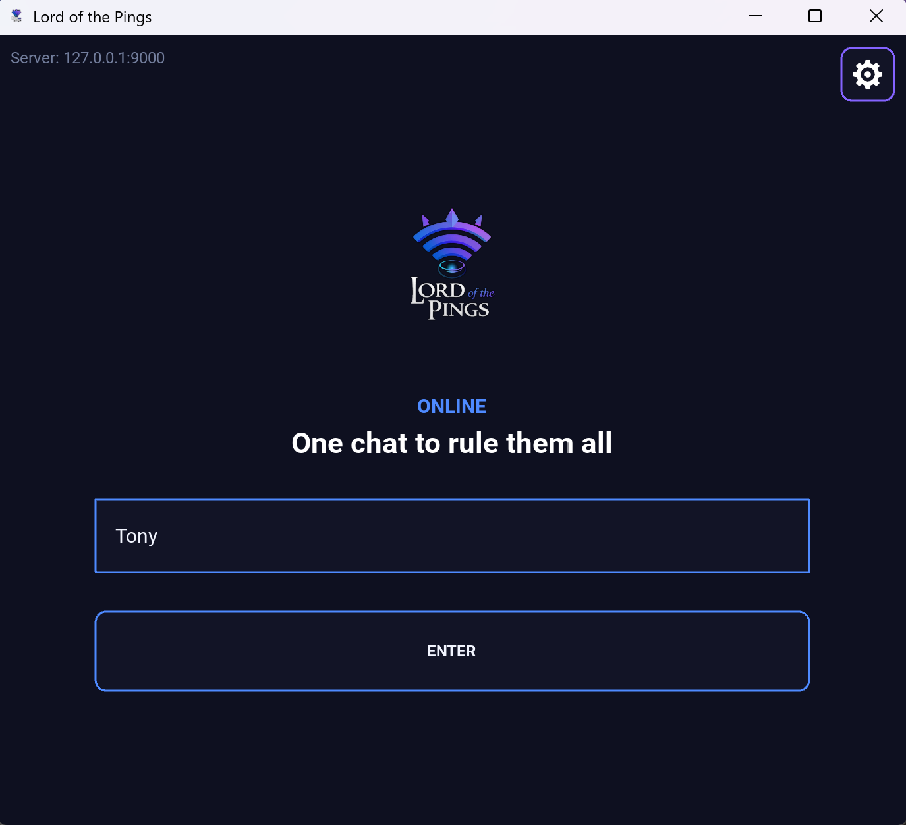

- שרת :

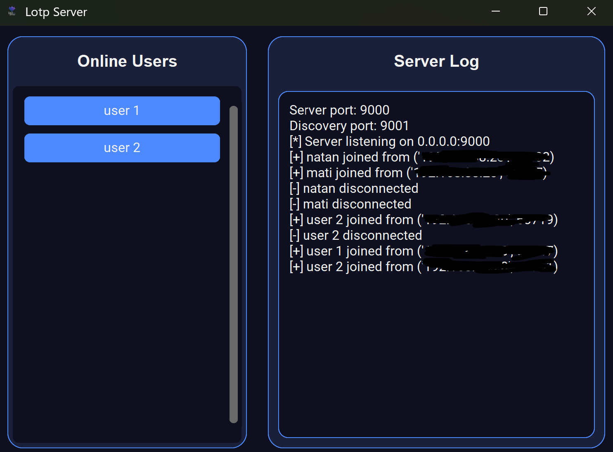

### 2. שליחת הודעת צ'אט
* **הסבר:** המשתמש מקליד הודעה. הלקוח עוטף אותה ב-JSON ושולח. השרת מקבל אותה ומפיץ אותה ללקוח הספציפי בשיחה פרטית או לכולם בצ'אט הקבוצתי .
- מסך ראשי:

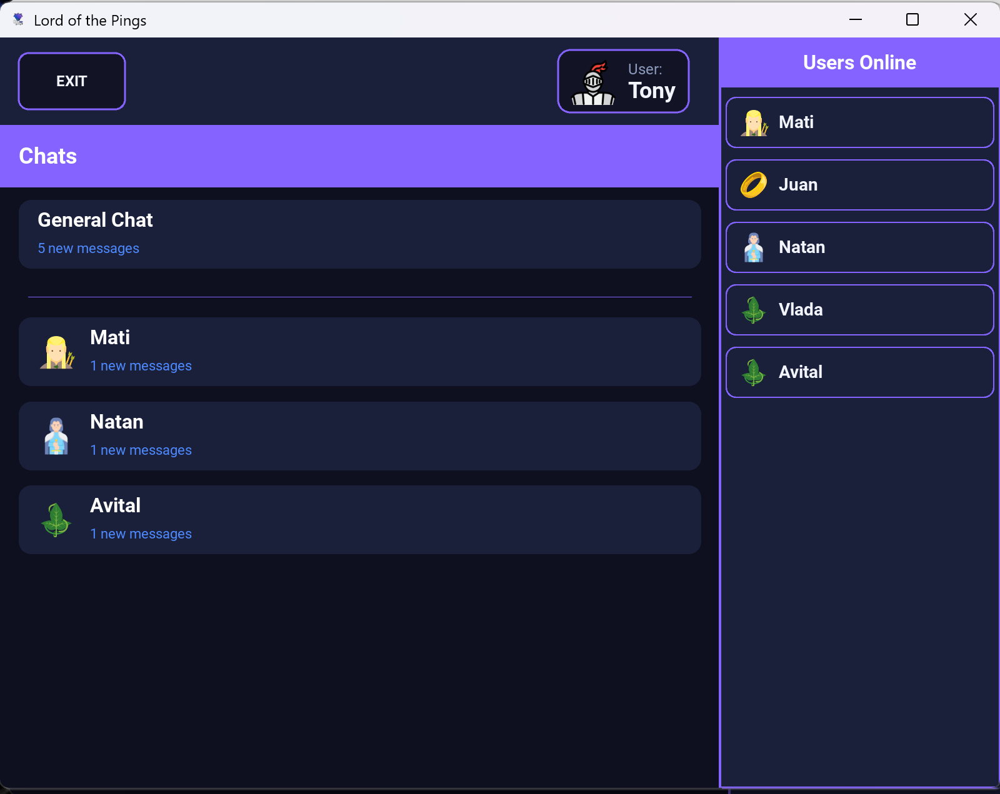

- שיחה פרטית: 

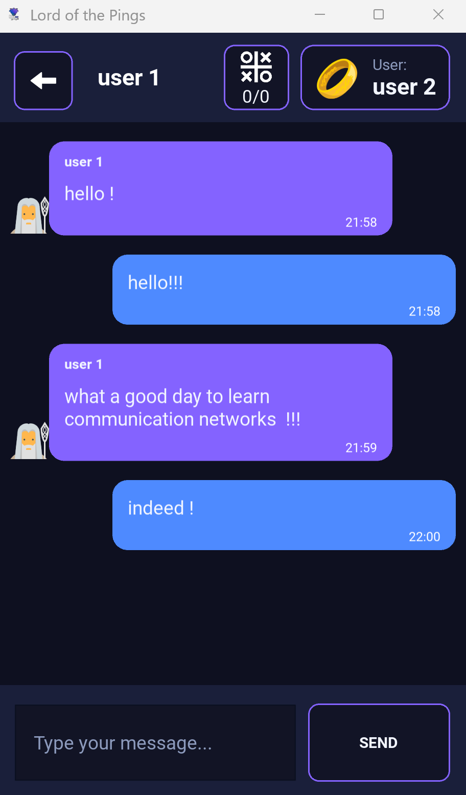

---
<a id="tcp-analysis"></a>
## ד. ניתוח תעבורה ב-Wireshark (TCP/IP Analysis)

ביצענו ניתוח מעמיק של תעבורת היישום כדי להבין את המעבר בין השכבות השונות במודל:

### 1. שכבת האפליקציה (Application) - Payload
הנתונים שנלכדו הם אובייקטי JSON. ב-Wireshark ניתן לראות את המחרוזת הגולמית בתוך ה-TCP Data.
* **מה רואים:** את השדות `type` ו-`data` בפורמט טקסט קריא (ASCII) (ניתן לראות כאן שליחת הודעה בצ'אט הכללי(general) בעל התוכן: "hello world!").

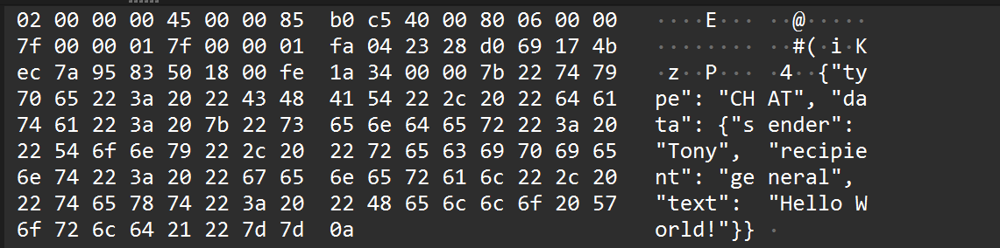

### 2. שכבת התעבורה (Transport) - TCP
כאן ניתן לראות את ניהול הקשר האמין:
* ** התחברות - (Three-way Handshake):** נצפו מנות SYN, SYN-ACK ו-ACK בתחילת ההתחברות.
* **פורטים:** השרת מאזין בפורט 9000 והלקוח משתמש בפורט דינמי גבוה.
* **דגלים (Flags):** שימוש בדגל PSH (Push) כדי להבטיח שהודעת הצ'אט תגיע מיד לממשק המשתמש.
       


### 3. שכבת הרשת (Network) - IP
כל מנה נארזה בתוך כותרת IPv4.
* **פרוטוקול:** השדה מציין '6', מה שמעיד שה-IP נושא בתוכו פרוטוקול TCP.

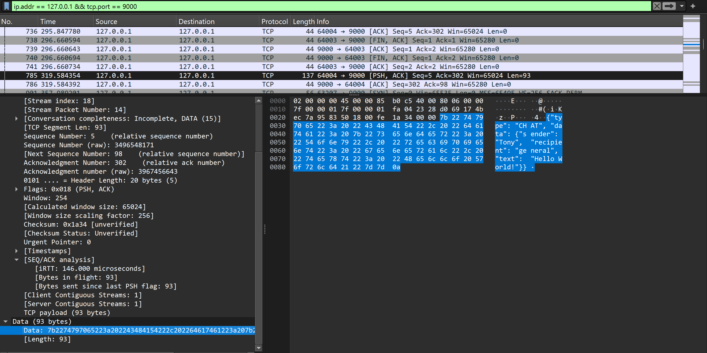

---

<a id="ai"></a>
## שימוש בבינה מלאכותית (AI)
נעשה שימוש בבינה מלאכותית ככלי עזר ללמידה ולפיתוח.

**מטרות השימוש:**
- הבנת פרוטוקולי רשת  
- שיפור מבנה הקוד  
- ניסוח והבהרת הסברים תיאורטיים
**דוגמאות לפרומט:**
```bash
How to connect multiple clients to one server using threads?
``` 

```bash
Please review how I handled the socket creation in my server and client in terms of efficiency and complexity
```


📘 **מה למדנו:**  
ה-AI הוא כלי עזר חזק כאשר משתמשים בו בצורה ביקורתית ומושכלת.

---
<a id="summary"></a>

##סיכום
הפרויקט סיפק הבנה מעמיקה של:
- מודל TCP/IP  
- תקשורת מבוססת Sockets  
- ריבוי לקוחות וניהול חיבורים  
- לכידה וניתוח תעבורת רשת אמיתית  

השילוב בין תיאוריה, מימוש וניתוח תעבורה תרם להבנה עמוקה של מערכות תקשורת מבוזרות.


</div>
